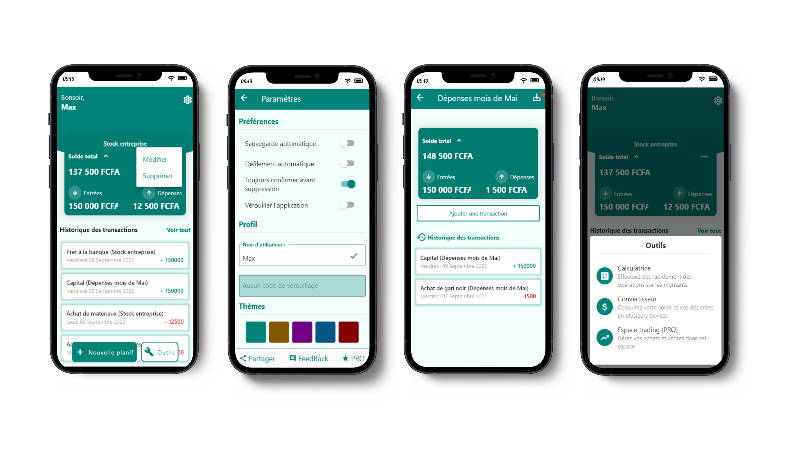

<p align="center">
  <a href="" rel="noopener">
 </a>
</p>

<h3 align="center">Spendings App in Flutter</h3>

<div align="center">

[]()
[](https://www.reddit.com/user/Wordbook_Bot)
[](/LICENSE)

</div>

---

<p align="center"> 🤖 Few lines describing what your bot does.
    <br>
</p>

## 📝 Table of Contents

- [About](#about)
- [Screenshots](#demo)
- [How it works](#working)
- [Getting Started](#getting_started)
- [Built Using](#built_using)
- [TODO](../TODO.md)
- [Contributing](../CONTRIBUTING.md)
- [Authors](#authors)

## 🧐 About <a name = "about"></a>

<p align="justify">My-Spendings is a budget tracking application that you can use to manage your expenses so that you always have an eye on your inflows and outflows. This app also offers tools like Converter, Calculator and another upcoming tool (Trading Room for traders).
</br>
<b><i>Only French is supported for the moment</i></b>
</p>

## 🖼️ Screenshots <a name = "demo"></a>



## 💭 How it works <a name = "working"></a>

<p align="justify">You must first add a <b>Schedule</b> which represents the follow-up of a given budget. It is also necessary to specify a <b>starting capital</b>.
Once this schedule has been created, you can add <b>transactions</b> that represent the inputs and outputs made on the budget. Capital is therefore the first transaction.
Schedules can be changed afterwards.</p>

## 🏁 Getting Started <a name = "getting_started"></a>

These instructions will get you a copy of the project up and running on your local machine for development and testing purposes.

### Prerequisites

You need to install [Flutter](https://docs.flutter.dev/get-started/install) and its dependencies before run this project. After the installation, run this command to check if everything is installed.

```bash
flutter doctor
```

### Running the app

A step by step series of examples that tell you how to get a development env running.

Get all packages

```bash
flutter pub get
```

And run the app

```bash
flutter run
```

</br>

## ⛏️ Built Using <a name = "built_using"></a>

- [Flutter](https://flutter.dev/) - Flutter framework
- [Dart](https://dart.dev/) - Dart Language

## ✍️ Authors <a name = "authors"></a>

- [@D3R50N](https://github.com/D3R50N) - Owner
